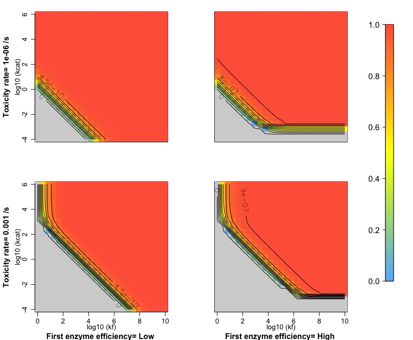
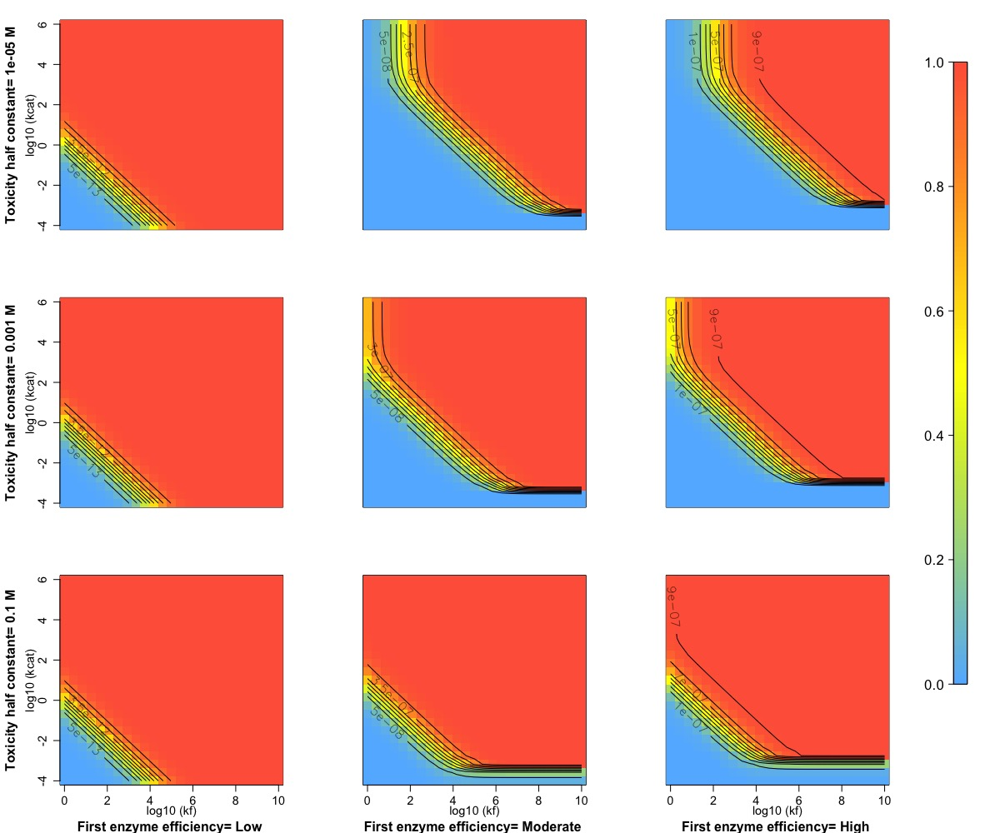

<script type="text/x-mathjax-config">
MathJax.Hub.Config({
  TeX: { equationNumbers: { autoNumber: "AMS" } }
});
</script>

## Fitness landscapes accounting for possible toxic effects

1)First model: linear cost, with $f=\Phi-\tau [S]$ where $\tau$ is the linear toxicity rate.

The following set of parameters was used:

```{r
###5bis.Plotting itness with a linear penalization
###Yields problems because of the linearity of the cost

N_reso=25
#Defining parameters
Vm_set=c(10^-6)#,10^-3) #unit: M.s^-1, with Vm=5.10^-5pmol.s^-1.cell^-1 and Vcell=50 micrometers^3
KT_set=c(5*10^-5)#,10^-3)#
log10kf_var<-c(0,10,2) #forward preferred to 1 as forward is already an emerging constant from diffusion and association
log10kcat_var<-c(-4,6,2) #catalytic preferred to -1 for same reasons
kf<-10^seq(log10kf_var[1],log10kf_var[2],length.out=N_reso)
kcat<-10^seq(log10kcat_var[1],log10kcat_var[2],length.out=N_reso)

E_tot_conc=10^-3##c(10^-7,10^-4) Both values need to be studied as what matters most is kf[Etot]
#Best possible values for the first reaction
kf1_set<-c(10^2,10^10)
kcat1_set<-c(10^-2,10^6)
#kr1_set<-c(10^5,10^6,10^3,10^4)
#kinh1_set<-c(10^9,10^10,10^7,10^8)
#Ki<-10^-6
eta_d_set<-c(10^-6)#degradation rate #Sensitivity study to be done relatively to Vm
delta_t_set<-c(10^-6,10^-3)#Toxicity penality

kf2_set<-kf
kcat2_set<-kcat
kr2_set<-c(10^3)##Testing with 2 values, but only one should be used later on in the paper
E1_conc<-E_tot_conc
E2_conc<-E_tot_conc
```

```{r LinearToxicity, echo=FALSE, fig.cap="Flux (and fitness) values obtained with linear toxicity rate", out.width = '100%',fig.align='center'}

```

Results are similar than with the degradation rate, for both processes induce a linear cost decreasing the actual flux, which is far lower in the case of a bad first enzyme, such that lower substrate concentrations still decrease the flux in much the same way than it does with an efficient first enzyme.

2)Second model: sigmoid cost (Clark, 1991; Wright and Rausher, 2007) representing the fact that increasing concentrations can interfere with other reactions and significantly alter fitness. It is computed through $f=\Phi(1-\frac{[S]}{[S]+T_{1/2}})$, where $T_{1/2}$ represents the half toxicity constant (substrate concentration for which the fitness given by a flux is half the value of the flux, because substrate disrupts another reaction dividing its yield by this factor).

```{r
###5ter.Plotting itness with a sigmoid toxicity
###Yields problems because of the linearity of the cost

N_reso=25
#Defining parameters
Vm_set=c(10^-6)#,10^-3) #unit: M.s^-1, with Vm=5.10^-5pmol.s^-1.cell^-1 and Vcell=50 micrometers^3
KT_set=c(5*10^-5)#,10^-3)#
log10kf_var<-c(0,10,2) #forward preferred to 1 as forward is already an emerging constant from diffusion and association
log10kcat_var<-c(-4,6,2) #catalytic preferred to -1 for same reasons
kf<-10^seq(log10kf_var[1],log10kf_var[2],length.out=N_reso)
kcat<-10^seq(log10kcat_var[1],log10kcat_var[2],length.out=N_reso)

E_tot_conc=10^-3##c(10^-7,10^-4) Both values need to be studied as what matters most is kf[Etot]
#Best possible values for the first reaction
kf1_set<-c(10^1,10^4,10^10)
kcat1_set<-c(10^-3,10^0,10^6)
#kr1_set<-c(10^5,10^6,10^3,10^4)
#kinh1_set<-c(10^9,10^10,10^7,10^8)
#Ki<-10^-6
eta_d_set<-c(10^-6)#degradation rate #Sensitivity study to be done relatively to Vm
T_half_set<-c(10^-5,10^-3,10^-1)#Toxiity penality

kf2_set<-kf
kcat2_set<-kcat
kr2_set<-c(10^3)##Testing with 2 values, but only one should be used later on in the paper
E1_conc<-E_tot_conc
E2_conc<-E_tot_conc
```

```{r ToxicityEffect, echo=FALSE, fig.cap="Flux (and fitness) values obtained with linear toxicity rate", out.width = '100%',fig.align='center'}

```